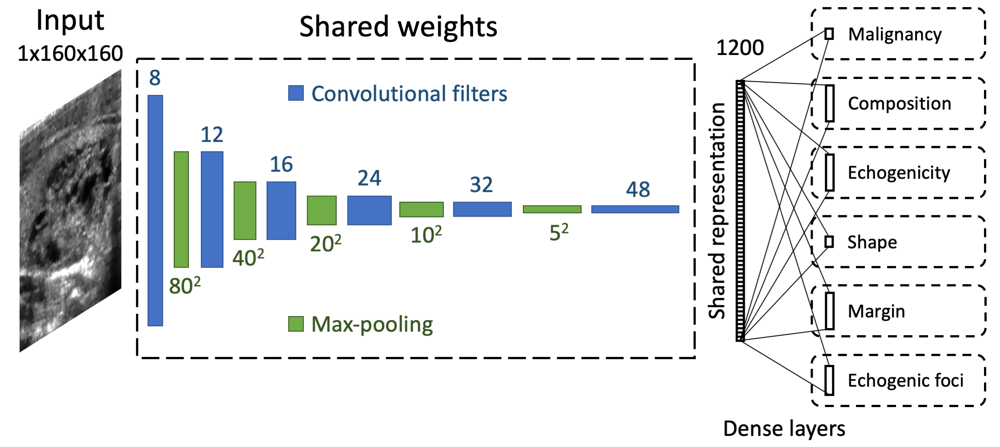
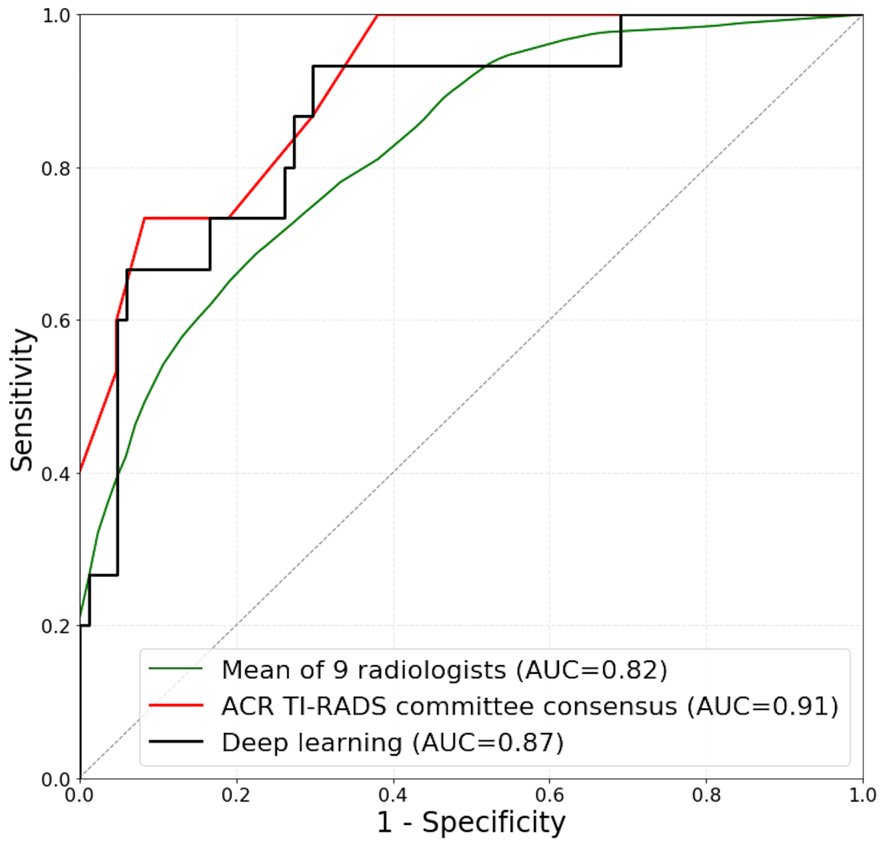

# thyroid-us

Code repository for *Evaluation of Thyroid Nodules Seen on Ultrasound: Comparison of Deep Learning to Radiologists Using ACR TI-RADS*.

Developed by [mateuszbuda](https://github.com/mateuszbuda).

It contains implementation of a multi-task CNN model using Keras framework with TensorFlow backend.



If you use this code in your research, consider citing:

```
@article{buda2019evaluation,
  title={Evaluation of Thyroid Nodules Seen on Ultrasound: Comparison of Deep Learning to Radiologists Using ACR TI-RADS},
  author={Buda, Mateusz and Wildman-Tobriner, Benjamin and Hoang, Jenny K and Thayer, David and Tessler, Franklin N and Middleton, William D and Mazurowski, Maciej A},
  journal={Radiology},
  year={2019},
  publisher={Radiological Society of North America}
}
```

ROC curves comparing our method to radiologists for evaluating malignancy on the test set of 99 cases:


